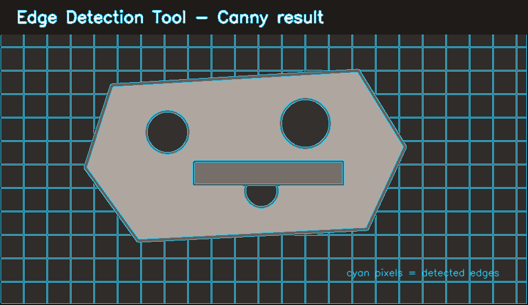
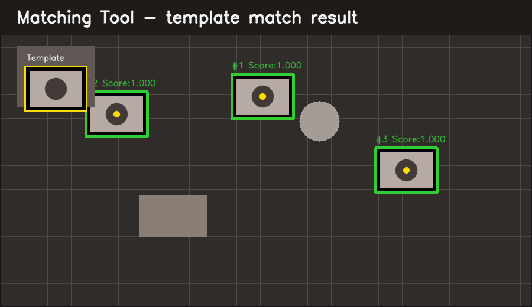
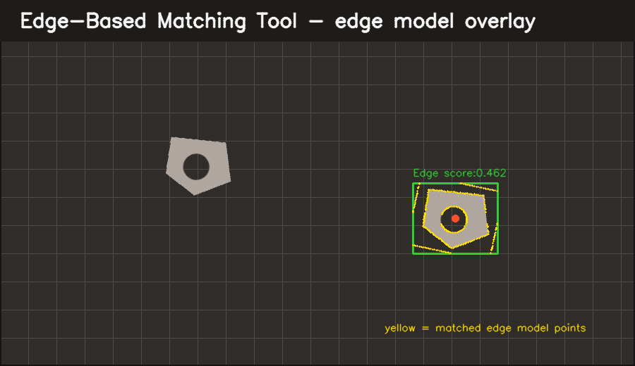
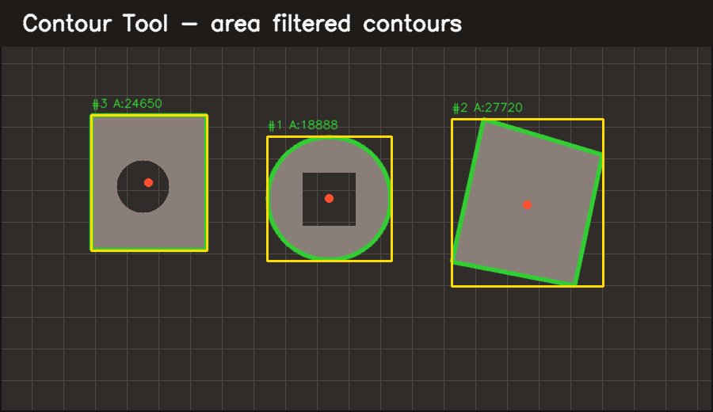
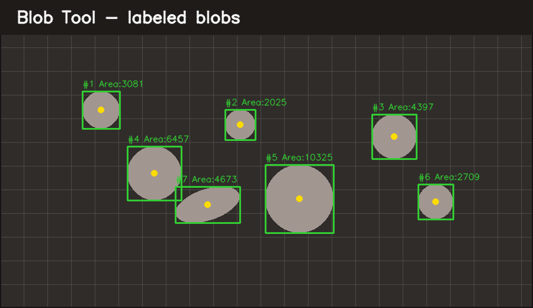
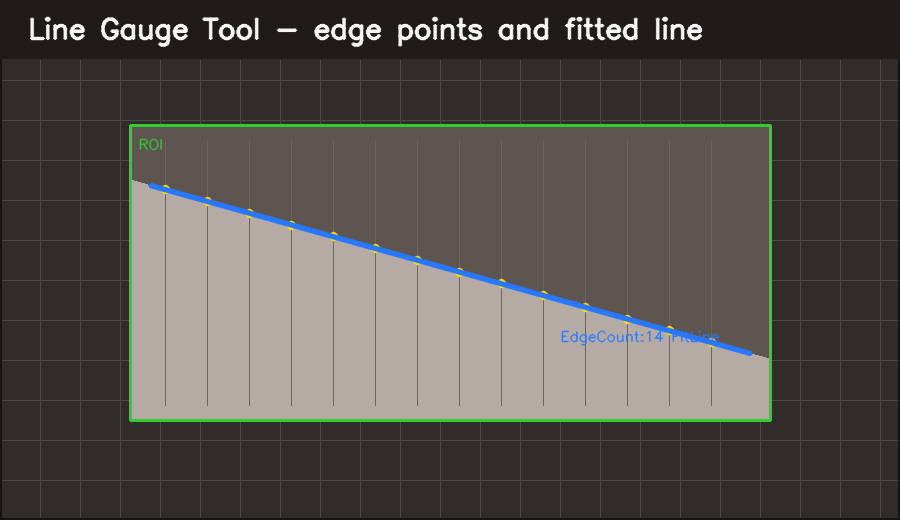

# Library-Noah

OpenCvSharp 기반의 C# 비전 검사 라이브러리입니다.

Threshold, Filter, Morphology, Edge, Contour, Matching, Line Gauge, Mean, Blob 등 검사 도구를 공통 실행 구조로 묶고, 결과 이미지/검출 결과/에러 코드/메트릭을 애플리케이션에서 사용하기 쉽게 제공합니다.

## 1분 요약

- `Lib.Common`은 Bitmap/Mat 변환, 좌표/라인 계산, OpenCV native DLL 패키징을 담당합니다.
- `Lib.OpenCV`는 Threshold, Filter, Edge, Contour, Matching, LineGauge 등 주요 검사 Tool을 제공합니다.
- `Lib.OpenCV.Blob`은 Blob 라벨링과 면적 필터링 기능을 제공합니다.
- 각 Tool은 `Execute(Mat source)`로 실행하고 `VisionToolResult`에서 성공 여부, 결과 이미지, 메트릭, 오버레이를 확인합니다.
- UI 프레임워크에 직접 의존하지 않으며, 콘솔/데스크톱/검사 프로그램에서 결과 `Mat`과 `Overlays`를 원하는 방식으로 표시할 수 있습니다.

## 설치/참조 방법

소스 프로젝트를 직접 참조하는 경우 사용하는 애플리케이션에서 필요한 프로젝트를 참조합니다.

```xml
<ItemGroup>
  <ProjectReference Include="..\Library-Noah\Lib.OpenCV\Lib.OpenCV.csproj" />
  <ProjectReference Include="..\Library-Noah\Lib.OpenCV.Blob\Lib.OpenCV.Blob.csproj" />
</ItemGroup>
```

로컬 NuGet 패키지로 사용하는 경우 먼저 패키지를 생성한 뒤 `artifacts/packages`를 패키지 소스로 추가합니다.

```powershell
dotnet pack Lib.Common.sln -c Release
dotnet add package Lib.OpenCV --source .\artifacts\packages
dotnet add package Lib.OpenCV.Blob --source .\artifacts\packages
```

## Quick Start

아래 예제는 샘플 이미지를 읽고 Canny Edge 결과를 `artifacts/smoke_edge.png`로 저장합니다.

```csharp
using System;
using System.IO;
using Lib.OpenCV;
using Lib.OpenCV.Property;
using Lib.OpenCV.Tool;
using OpenCvSharp;

Directory.CreateDirectory("artifacts");

using (Mat source = Cv2.ImRead("docs/samples/vision_sample.png", ImreadModes.Grayscale))
{
    using EdgeDetectionTool tool = new EdgeDetectionTool();
    tool.SetProperty(new EdgeDetectionToolProperty
    {
        EdgeType = EdgeDetectionToolType.Canny,
        CannyThresholdLow = 80,
        CannyThresholdHigh = 160,
        CannyApertureSize = 3
    });

    using VisionToolResult result = tool.Execute(source);
    if (!result.Success)
    {
        throw new InvalidOperationException($"{result.ErrorName}: {result.Message}");
    }

    Cv2.ImWrite("artifacts/smoke_edge.png", result.ResultImage);
}
```

## 샘플 데이터

- 입력 샘플: `docs/samples/vision_sample.png`
- README 검출 결과 이미지: `docs/images/*.png`

기본 예제는 저장소 루트에서 실행하는 것을 기준으로 `docs/samples/vision_sample.png`를 사용합니다. 다른 위치에서 실행하는 경우 이미지 경로를 실행 파일 기준으로 조정하세요.

## Matching Contract References

- Auto MPoint teaching core: `docs/AUTO_MPOINT_V1.md`
- Edge-based fail-closed unique result: `docs/EDGE_BASED_UNIQUE_MATCH_V1.md`

## Build / Smoke Check

빌드 확인:

```powershell
dotnet restore Lib.Common.sln
dotnet build Lib.Common.sln -c Debug
```

패키징까지 포함한 smoke check:

```powershell
dotnet restore Lib.Common.sln
dotnet build Lib.Common.sln -c Debug
dotnet pack Lib.Common.sln -c Debug --no-build
```

현재 별도 테스트 프로젝트는 없으므로 smoke check는 전체 솔루션 빌드와 패키지 생성 성공 여부를 기준으로 합니다.

## CI

GitHub Actions workflow는 `.github/workflows/build.yml`에 있습니다. `main` 브랜치 push와 pull request에서 다음 작업을 수행합니다.

1. .NET SDK 설치
2. `dotnet restore Lib.Common.sln`
3. `dotnet build Lib.Common.sln -c Debug --no-restore`
4. `dotnet pack Lib.Common.sln -c Debug --no-build`

## 라이선스

이 프로젝트는 MIT License로 배포됩니다. 상업적 사용, 수정, 배포는 허용되지만, 이 프로젝트 또는 주요 소스 일부를 사용하는 경우 저작권 고지, 라이선스 문구, NOTICE의 귀속 고지를 유지해야 합니다.

Copyright (c) 2026 최노아(Noah-Choi)

- 라이선스 전문: [LICENSE](LICENSE)
- 귀속 고지: [NOTICE](NOTICE)

재배포, 패키징, 또는 파생 작업에 이 라이브러리의 주요 부분이 포함되는 경우 `LICENSE`와 `NOTICE`를 삭제하거나 흐리게 표시하지 마세요.

## 개발 환경

- Visual Studio 2022 또는 .NET SDK
- C# / .NET Standard 2.0
- Windows 런타임 권장
- OpenCvSharp 관련 DLL은 `Lib.Common/DLL`에 포함되어 있습니다.

빌드:

```powershell
dotnet restore Lib.Common.sln
dotnet build Lib.Common.sln -c Release
```

## 프로젝트 구조

```text
Library-Noah
|- Lib.Common
|  |- Bitmap
|  |- Converter
|  |- Line
|  |- DLL
|  `- build
|- Lib.OpenCV
|  `- OpenCV
|     |- Pipeline
|     |- Property
|     |- Result
|     `- Tool
`- Lib.OpenCV.Blob
```

| 프로젝트 | 역할 |
| --- | --- |
| `Lib.Common` | 공통 유틸리티, Bitmap/Mat 변환, 좌표/ROI 변환, 라인 계산, 디렉터리/COM 포트 보조 기능 |
| `Lib.OpenCV` | 주요 OpenCV 검사 도구, 속성 인터페이스, 결과 모델, 파이프라인 실행 구조 |
| `Lib.OpenCV.Blob` | Blob 라벨링/면적 필터링 도구 |

참조 관계:

```text
Lib.Common
`- Lib.OpenCV
   `- Lib.OpenCV.Blob
```

## 코드 구조

### Lib.Common

- `Converter`: `Bitmap`, `Mat`, `Point`, `Rect`, `Rectangle` 변환 유틸리티
- `Bitmap`: `BitmapHelper`, `BitmapProcessing` 등 Bitmap 직접 처리 기능
- `Line`: 직선 피팅, 수직선 계산, 교차점 계산용 모델과 계산기
- `CFormula`, `FormulaUtil`: 각도, 교차점, 원근 변환, 폴리곤 판정 등 수식 유틸리티
- `AppUtil`, `CUtil`: 디렉터리 초기화, 폴더 동기화, 드라이브/COM 포트 조회 등 애플리케이션 보조 기능

### Lib.OpenCV

- `OpenCV/Tool`: 실제 검사 도구 구현
- `OpenCV/Property`: 각 도구가 사용하는 설정 인터페이스와 일부 기본 속성 클래스
- `OpenCV/Result`: Matching, Contour, Mean, LineGauge 등 도구별 결과 모델
- `OpenCV/Pipeline`: 여러 도구를 순차 실행하는 파이프라인 모델과 런타임
- `OpenCvHelper`: Mat 유효성 검사와 채널 변환 유틸리티

### Lib.OpenCV.Blob

- `BlobTool`: 새 실행 구조를 사용하는 Blob 도구
- `BlobResult`: Blob 결과 모델
- `CVBlob`, `CResultBlob`: 기존 코드 호환을 위한 레거시 API

## Tool 실행 구조

새 도구들은 대부분 `OpenCvAlgorithmBase`를 상속합니다.

```text
IVisionTool
`- OpenCvAlgorithmBase
   |- ThresholdTool
   |- MorphologyTool
   |- FilterTool
   |- EdgeDetectionTool
   |- RotateScaleTool
   |- ContourTool
   |- CornerTool
   |- MatchingTool
   |- LineGaugeTool
   |- MeanTool
   `- BlobTool
```

기본 실행 흐름:

1. Tool 객체를 생성합니다.
2. Tool에 Property를 설정합니다.
3. `Execute(Mat source)`를 호출합니다.
4. `VisionToolResult`에서 성공 여부, 결과 이미지, 에러 코드, 메트릭, 오버레이를 확인합니다.

```csharp
using VisionToolResult result = tool.Execute(source);

if (result.Success)
{
    Mat output = result.ResultImage;
}
else
{
    string error = $"{result.ErrorName}: {result.Message}";
}
```

`Execute`는 입력 이미지 검증, 파라미터 검증, 예외 처리, 결과 이미지 복사, 메트릭 수집을 공통으로 처리합니다. 기존 코드와 호환되는 `CV*` 계열 클래스는 `Run()` 호출 후 `results` 또는 `resultList`를 직접 읽는 구조입니다.

## 지원 Tool 요약

| Tool | 주요 용도 | Property |
| --- | --- | --- |
| `ThresholdTool` | 이진화, 범위 이진화, Adaptive Threshold | `ThresholdToolProperty` |
| `MorphologyTool` | Erode, Dilate, Open, Close 등 형태학 연산 | `MorphologyToolProperty` |
| `FilterTool` | Blur, Gaussian, Median, Bilateral 등 필터 | `FilterToolProperty` |
| `EdgeDetectionTool` | Canny, Sobel, Scharr, Laplacian 엣지 검출 | `EdgeDetectionToolProperty` |
| `RotateScaleTool` | 이미지 회전/스케일 변환 | `RotateScaleToolProperty` |
| `ContourTool` | Contour 검출과 면적 필터링 | `IOpenCVPropertyContour` 구현체 |
| `CornerTool` | sub-pixel corner 검출과 전역 좌표 결과 | `IOpenCVPropertyContour` 구현체 |
| `BlobTool` | Blob 라벨링과 면적 필터링 | `IOpenCVPropertyBlob` 구현체 |
| `MatchingTool` | Template Matching, Scale/Angle 탐색 | `IOpenCVPropertyMatching` 구현체 |
| `EdgeBasedTemplateMatchingTool` | 엣지 기반 템플릿 매칭 | `IOpenCVPropertyEdgeBasedTemplateMatching` 구현체 |
| `AutoMPointTool` | 고정 크기 매칭 후보 자동 제안, 유일성/합성 변형/속도 검증 | `AutoMPointToolProperty` |
| `SiftTool` | SIFT 특징점 기반 매칭 | `IOpenCVPropertyFeatureSIFT` 구현체 |
| `LineGaugeTool` | ROI 내 엣지 검출 후 직선 피팅 | `IOpenCvPropertyLineGauge` 구현체 |
| `MeanTool` | ROI 평균/표준편차 계산 | `IOpenCVPropertyMean` 구현체 |

`MeanTool`의 multi-ROI 실행은 `CvROIS` 순서대로 각 영역을 측정하고 같은 순서의 `MeanResult.index`를 제공합니다. `CornerTool`은 sub-pixel 보정된 각 점을 전역 이미지 좌표의 `CornerResult`로 제공하며, 검출점이 없으면 `CornerNoResult`를 반환합니다.

## 기본 사용 예제

### ThresholdTool

```csharp
using System;
using Lib.OpenCV;
using Lib.OpenCV.Property;
using Lib.OpenCV.Tool;
using OpenCvSharp;

public static class ThresholdExample
{
    public static void Run()
    {
        using (Mat source = Cv2.ImRead("docs/samples/vision_sample.png", ImreadModes.Color))
        {
            ThresholdTool tool = new ThresholdTool();
            tool.SetProperty(new ThresholdToolProperty
            {
                Mode = ThresholdToolMode.Threshold,
                Threshold = 120,
                MaxValue = 255,
                ThresholdType = ThresholdTypes.Binary
            });

            VisionToolResult result = tool.Execute(source);
            if (!result.Success)
            {
                throw new InvalidOperationException($"{result.ErrorName}: {result.Message}");
            }

            Cv2.ImWrite("result_threshold.png", result.ResultImage);
            result.ResultImage?.Dispose();
        }
    }
}
```

### Filter 후 Edge 검출

Canny 기반 Edge 검출은 단일 채널 입력을 사용하는 것이 안전합니다.

```csharp
using Lib.OpenCV;
using Lib.OpenCV.Property;
using Lib.OpenCV.Tool;
using OpenCvSharp;

using (Mat source = Cv2.ImRead("docs/samples/vision_sample.png", ImreadModes.Grayscale))
{
    FilterTool filter = new FilterTool();
    filter.SetProperty(new FilterToolProperty
    {
        FilterType = FilterToolType.GaussianBlur,
        KernelWidth = 5,
        KernelHeight = 5
    });

    VisionToolResult filtered = filter.Execute(source);
    if (!filtered.Success)
    {
        throw new Exception(filtered.Message);
    }

    EdgeDetectionTool edge = new EdgeDetectionTool();
    edge.SetProperty(new EdgeDetectionToolProperty
    {
        EdgeType = EdgeDetectionToolType.Canny,
        CannyThresholdLow = 80,
        CannyThresholdHigh = 160,
        CannyApertureSize = 3
    });

    VisionToolResult edgeResult = edge.Execute(filtered.ResultImage);
    if (!edgeResult.Success)
    {
        throw new Exception(edgeResult.Message);
    }

    Cv2.ImWrite("result_edge.png", edgeResult.ResultImage);

    filtered.ResultImage?.Dispose();
    edgeResult.ResultImage?.Dispose();
}
```

### BlobTool

`BlobTool`은 `IOpenCVPropertyBlob` 구현체가 필요합니다. 애플리케이션의 설정 모델이 이 인터페이스를 구현해도 되고, 아래처럼 전용 클래스를 만들어도 됩니다.

```csharp
using System.Collections.Generic;
using Lib.OpenCV.Blob;
using OpenCvSharp;

public sealed class BlobProperty : IOpenCVPropertyBlob
{
    public string NAME { get; set; } = "Blob";
    public double PIXELPERMM { get; set; } = 1;
    public bool USE_THRESHOLD { get; set; } = true;
    public bool USE_BITWISENOT { get; set; }
    public ThresholdTypes THRESHOLD_TYPES { get; set; } = ThresholdTypes.Binary;
    public double THRESHOLD { get; set; } = 120;
    public bool USE_ADAPTIVE_THRESHOLD { get; set; }
    public double ADAPTIVE_THRESHOLD { get; set; } = 255;
    public ThresholdTypes ADAPTIVE_THRESHOLD_TYPES { get; set; } = ThresholdTypes.Binary;
    public AdaptiveThresholdTypes ADAPTIVE_THRESHOLD_ALGORITHM { get; set; } = AdaptiveThresholdTypes.MeanC;
    public int BlockSize { get; set; } = 25;
    public int Weight { get; set; } = 5;
    public bool USE_ROI { get; set; }
    public bool USE_MULTI_ROI { get; set; }
    public Rect CvROI { get; set; } = new Rect();
    public List<Rect> CvROIS { get; set; } = new List<Rect>();
    public List<Rect> CvMASKS { get; set; } = new List<Rect>();
    public int MIN_AREA { get; set; } = 20;
    public int MAX_AREA { get; set; } = 100000;
}
```

사용:

```csharp
using System;
using Lib.OpenCV.Blob;
using Lib.OpenCV.Tool;
using OpenCvSharp;

using (Mat source = Cv2.ImRead("docs/samples/vision_sample.png", ImreadModes.Grayscale))
{
    BlobTool tool = new BlobTool();
    tool.SetProperty(new BlobProperty
    {
        USE_THRESHOLD = true,
        THRESHOLD = 120,
        MIN_AREA = 50,
        MAX_AREA = 5000,
        USE_ROI = true,
        CvROI = new Rect(100, 100, 300, 200)
    });

    VisionToolResult result = tool.Execute(source);
    if (!result.Success)
    {
        throw new Exception(result.Message);
    }

    foreach (BlobResult blob in tool.results)
    {
        Console.WriteLine($"#{blob.Index}, Area={blob.Area}, Center={blob.Center}");
    }

    result.ResultImage?.Dispose();
}
```

## Pipeline 사용

파이프라인은 여러 Tool을 layer 기반으로 순차 실행합니다.

현재 기본 `VisionPipelineToolFactory`가 생성할 수 있는 Tool은 다음입니다.

- `threshold`
- `morphology`
- `filter`
- `edge` 또는 `edgedetection`
- `rotatescale`
- `affine`, `affinematrix` 또는 `affinetransform`

예제:

```csharp
using Lib.OpenCV.Pipeline;
using Lib.OpenCV.Property;
using OpenCvSharp;

VisionPipeline pipeline = new VisionPipeline
{
    Name = "Preprocess"
};

VisionPipelineStep threshold = new VisionPipelineStep
{
    Name = "Binary",
    ToolType = "threshold",
    InputLayer = "input",
    OutputLayer = "binary"
};

threshold.Parameters[nameof(ThresholdToolProperty.Mode)] = "Threshold";
threshold.Parameters[nameof(ThresholdToolProperty.Threshold)] = "120";
threshold.Parameters[nameof(ThresholdToolProperty.MaxValue)] = "255";

pipeline.Steps.Add(threshold);

using (Mat source = Cv2.ImRead("docs/samples/vision_sample.png", ImreadModes.Color))
using (VisionPipelineContext context = new VisionPipelineContext())
{
    context.SetLayer("input", source);

    VisionPipelineRuntime runtime = new VisionPipelineRuntime();
    using VisionPipelineRunResult runResult = runtime.Run(pipeline, context);

    if (!runResult.Success)
    {
        VisionPipelineStepResult failed = runResult.StepResults[runResult.StepResults.Count - 1];
        throw new Exception(failed.ToolResult?.Message ?? failed.AcceptanceMessage);
    }

    using (Mat binary = context.GetLayer("binary"))
    {
        Cv2.ImWrite("result_pipeline.png", binary);
    }
}
```

## 네이티브 이미지 리소스 소유권

- 호출자는 `Execute(Mat source)`에 전달한 입력 `Mat`을 계속 소유합니다. Tool이나 Runner는 이 입력을 해제하지 않습니다.
- `OpenCvAlgorithmBase` 기반 Tool은 내부 source/result/template 복사본을 소유하므로 사용 후 Tool을 `Dispose()`해야 합니다.
- `VisionToolResult`는 `ResultImage`를 소유합니다. 결과를 다 사용한 뒤 `VisionToolResult.Dispose()`를 호출하며, 그 이후에는 기존 `ResultImage` 참조를 사용하지 않습니다.
- `VisionPipelineContext.SetLayer`는 입력 이미지를 복제해 보관하고, `GetLayer`는 호출자가 해제해야 하는 새 복사본을 반환합니다.
- `VisionPipelineRunResult.Dispose()`는 모든 step의 `VisionToolResult`와 결과 이미지를 해제합니다. 기본 Runtime은 기본 팩터리가 생성한 Tool도 해제합니다.
- 사용자 팩터리를 받는 `VisionPipelineRuntime(factory)`는 호환성을 위해 Tool을 호출자 소유로 유지합니다. Runtime이 팩터리 생성 Tool을 소유하게 하려면 `VisionPipelineRuntime(factory, true)`를 사용합니다.
- `CombinedInspectionRunResult.Dispose()`는 포함된 2D 결과 이미지만 해제합니다. 입력 `Image`, `HeightMap`, 전달한 Tool은 호출자 소유입니다.

## 결과 확인

`VisionToolResult`의 주요 필드:

| 필드 | 의미 |
| --- | --- |
| `Success` | Tool 실행 성공 여부 |
| `Message` | 실패 또는 검증 메시지 |
| `ErrorCode`, `ErrorName` | 실패 원인을 구분하기 위한 에러 코드 |
| `ResultStatus` | `Passed`, `InvalidInput`, `InvalidParameter`, `InvalidRoi`, `Exception` 등 상태 |
| `ResultImage` | Tool 실행 후 결과 이미지 |
| `Elapsed` | 실행 시간 |
| `Metrics` | 결과 개수, 이미지 크기, 면적/스코어/각도 등 수치 정보 |
| `Overlays` | UI 표시용 사각형, 점, 라인 등 오버레이 정보 |

## 검출 결과 이미지 표시

검사 프로그램에서는 Tool 실행 결과를 바로 화면에 표시해야 하는 경우가 많습니다. 이 라이브러리는 UI 프레임워크에 직접 의존하지 않도록 `Mat`과 `VisionToolResult.Overlays`를 제공합니다.

권장 흐름:

1. 원본 이미지 `Mat`을 Tool에 입력합니다.
2. `VisionToolResult`를 받습니다.
3. 표시용 이미지에는 원본 이미지를 복사한 뒤 `Overlays`를 그립니다.
4. UI 프로젝트에서는 표시용 `Mat`을 `Bitmap`, `BitmapSource` 등 화면 컨트롤이 요구하는 타입으로 변환해서 표시합니다.

### 실제 검출 예시 이미지

아래 이미지는 README용 샘플 이미지에 Edge, Matching, Edge-Based Matching, Contour, Blob, LineGauge 검출/피팅을 적용한 결과입니다. 각 Tool을 사용하면 어떤 형태의 검출 결과가 화면에 표시되는지 빠르게 확인할 수 있습니다.

<table>
  <tr>
    <th>Edge Detection</th>
    <th>Matching</th>
    <th>Edge-Based Matching</th>
  </tr>
  <tr>
    <td></td>
    <td></td>
    <td></td>
  </tr>
  <tr>
    <th>Contour</th>
    <th>Blob</th>
    <th>LineGauge</th>
  </tr>
  <tr>
    <td></td>
    <td></td>
    <td></td>
  </tr>
</table>

### 공통 오버레이 렌더러

`MatchingTool`, `EdgeBasedTemplateMatchingTool`, `ContourTool`, `BlobTool`, `LineGaugeTool`은 `VisionToolResult.Overlays`에 사각형, 점, 점 목록, 직선 정보를 담습니다. 다음 헬퍼를 UI 프로젝트에 두면 대부분의 검출 결과를 같은 방식으로 표시할 수 있습니다.

```csharp
using System;
using System.Drawing;
using Lib.OpenCV;
using Lib.OpenCV.Tool;
using OpenCvSharp;
using CvPoint = OpenCvSharp.Point;

public static class VisionDisplayHelper
{
    public static Mat DrawVisionResult(Mat source, VisionToolResult result)
    {
        if (source == null || source.Empty())
        {
            return new Mat();
        }

        Mat display = source.Clone();
        OpenCvHelper.SetImageChannel3(display);

        if (result == null || !result.Success)
        {
            return display;
        }

        foreach (VisionToolOverlay overlay in result.Overlays)
        {
            DrawOverlay(display, overlay);
        }

        return display;
    }

    private static void DrawOverlay(Mat image, VisionToolOverlay overlay)
    {
        Scalar color = new Scalar(50, 205, 50);

        switch (overlay.Kind)
        {
            case VisionToolOverlayKind.Rectangle:
                DrawRectangle(image, overlay.Bounds, color);
                DrawText(image, overlay.Label, overlay.Bounds.X, overlay.Bounds.Y - 6, color);
                if (overlay.Center != PointF.Empty)
                {
                    DrawPoint(image, overlay.Center, Scalar.Yellow);
                }
                break;

            case VisionToolOverlayKind.Point:
                DrawPoint(image, overlay.Center, color);
                DrawText(image, overlay.Label, overlay.Center.X + 5, overlay.Center.Y - 5, color);
                break;

            case VisionToolOverlayKind.Points:
                foreach (PointF point in overlay.Points)
                {
                    DrawPoint(image, point, Scalar.Yellow, 2);
                }
                DrawText(image, overlay.Label, overlay.Center.X + 5, overlay.Center.Y - 5, color);
                break;

            case VisionToolOverlayKind.Line:
                Scalar lineColor = new Scalar(255, 191, 0);
                Cv2.Line(image, ToCvPoint(overlay.Start), ToCvPoint(overlay.End), lineColor, 2, LineTypes.AntiAlias);
                DrawText(image, overlay.Label, overlay.Center.X + 5, overlay.Center.Y - 5, lineColor);
                break;
        }
    }

    private static void DrawRectangle(Mat image, RectangleF bounds, Scalar color)
    {
        Rect rect = new Rect(
            (int)Math.Round(bounds.X),
            (int)Math.Round(bounds.Y),
            Math.Max(1, (int)Math.Round(bounds.Width)),
            Math.Max(1, (int)Math.Round(bounds.Height)));

        Cv2.Rectangle(image, rect, color, 2, LineTypes.AntiAlias);
    }

    private static void DrawPoint(Mat image, PointF point, Scalar color, int radius = 4)
    {
        Cv2.Circle(image, ToCvPoint(point), radius, color, Cv2.FILLED, LineTypes.AntiAlias);
    }

    private static void DrawText(Mat image, string text, float x, float y, Scalar color)
    {
        if (string.IsNullOrWhiteSpace(text))
        {
            return;
        }

        Cv2.PutText(
            image,
            text,
            new CvPoint(Math.Max(0, (int)Math.Round(x)), Math.Max(15, (int)Math.Round(y))),
            HersheyFonts.HersheySimplex,
            0.45,
            color,
            1,
            LineTypes.AntiAlias);
    }

    private static CvPoint ToCvPoint(PointF point)
    {
        return new CvPoint((int)Math.Round(point.X), (int)Math.Round(point.Y));
    }
}
```

사용:

```csharp
VisionToolResult result = tool.Execute(source);

using (Mat display = VisionDisplayHelper.DrawVisionResult(source, result))
{
    Cv2.ImWrite("display_result.png", display);

    // WinForms/WPF/기타 UI에서는 여기서 display Mat을 화면용 이미지 타입으로 변환해 표시합니다.
    // 예: Bitmap bitmap = Lib.Common.BitmapImageConverter.ToBitmap(display);
}
```

### Tool별 표시 기준

| Tool | 표시 방법 |
| --- | --- |
| `EdgeDetectionTool` | `result.ResultImage`가 Edge 이미지입니다. 그대로 표시하거나, 필요하면 `OpenCvHelper.SetImageChannel3` 후 색상 표시를 추가합니다. |
| `MatchingTool` | `tool.results`에 `MatchingResult`가 들어 있고, `result.Overlays`에 매칭 사각형/중심점/점수 라벨이 들어갑니다. 공통 오버레이 렌더러를 사용하면 됩니다. |
| `EdgeBasedTemplateMatchingTool` | `MatchingTool`과 같은 `MatchingResult` 구조를 사용합니다. `USE_DRAW_IMAGE = true`이면 Tool 내부에서 Edge 모델 윤곽을 `ResultImage`에 그립니다. |
| `ContourTool` | `USE_DRAW_IMAGE = true`이면 `ResultImage`에 Contour가 그려집니다. UI에서 일관된 스타일이 필요하면 공통 오버레이 렌더러를 사용합니다. |
| `BlobTool` | `tool.results`에 `BlobResult`가 들어 있고, `result.Overlays`에 Bounding/Center/Area 정보가 들어갑니다. 공통 오버레이 렌더러를 사용하면 됩니다. |
| `LineGaugeTool` | `tool.resultList`에 FitLine과 Edge 목록이 들어 있고, `result.Overlays`에 Edge points와 Fit line이 들어갑니다. 공통 오버레이 렌더러를 사용하면 됩니다. |

### Matching / EdgeBasedMatching 표시 예제

```csharp
using Lib.OpenCV.Result;
using Lib.OpenCV.Tool;
using OpenCvSharp;

MatchingTool tool = new MatchingTool();
tool.SetProperty(matchingProperty);
tool.SetTemplateImage(template);

VisionToolResult result = tool.Execute(source);

using (Mat display = VisionDisplayHelper.DrawVisionResult(source, result))
{
    Cv2.ImWrite("display_matching.png", display);
}

foreach (MatchingResult match in tool.results)
{
    Console.WriteLine($"#{match.Index}, Score={match.Score:0.000}, Center={match.Center}, Angle={match.Angle:0.00}, Scale={match.Scale:0.000}");
}
```

엣지 기반 매칭도 표시 방식은 동일합니다.

```csharp
EdgeBasedTemplateMatchingTool tool = new EdgeBasedTemplateMatchingTool();
tool.SetProperty(edgeBasedMatchingProperty);
tool.SetTemplateImage(template);

VisionToolResult result = tool.Execute(source);

using (Mat display = VisionDisplayHelper.DrawVisionResult(source, result))
{
    Cv2.ImWrite("display_edge_matching.png", display);
}
```

### Contour / Blob 표시 예제

```csharp
ContourTool contourTool = new ContourTool();
contourTool.SetProperty(contourProperty);

VisionToolResult contourResult = contourTool.Execute(source);

using (Mat contourDisplay = VisionDisplayHelper.DrawVisionResult(source, contourResult))
{
    Cv2.ImWrite("display_contour.png", contourDisplay);
}
```

```csharp
BlobTool blobTool = new BlobTool();
blobTool.SetProperty(blobProperty);

VisionToolResult blobResult = blobTool.Execute(source);

using (Mat blobDisplay = VisionDisplayHelper.DrawVisionResult(source, blobResult))
{
    Cv2.ImWrite("display_blob.png", blobDisplay);
}
```

### LineGauge 표시 예제

```csharp
LineGaugeTool lineTool = new LineGaugeTool();
lineTool.SetProperty(lineGaugeProperty);

VisionToolResult lineResult = lineTool.Execute(source);

using (Mat lineDisplay = VisionDisplayHelper.DrawVisionResult(source, lineResult))
{
    Cv2.ImWrite("display_line_gauge.png", lineDisplay);
}

foreach (var item in lineTool.resultList)
{
    Console.WriteLine($"#{item.Index}, EdgeCount={item.EdgePointCount}, FitLine={item.FitLine.Start}->{item.FitLine.End}");
}
```

## ROI와 전처리 규칙

`IOpenCVPropertyBase`를 구현하는 Tool은 공통 전처리 옵션을 사용할 수 있습니다.

- `USE_ROI`: 단일 ROI 사용
- `USE_MULTI_ROI`: 여러 ROI 사용
- `CvROI`: 단일 ROI
- `CvROIS`: 여러 ROI 목록
- `CvMASKS`: 결과 제외 영역
- `USE_THRESHOLD`: 실행 전 Threshold 적용
- `USE_ADAPTIVE_THRESHOLD`: 실행 전 Adaptive Threshold 적용
- `USE_BITWISENOT`: 흑백 반전

ROI의 폭 또는 높이가 0인 경우 Tool에 따라 전체 이미지로 대체되거나 실패합니다. `LineGaugeTool`처럼 ROI가 필수인 Tool은 유효한 `CvROI` 또는 `CvROIS`를 지정해야 합니다.

## 레거시 API

기존 호환을 위해 `CV*`, `C*` 계열 클래스가 남아 있습니다.

예:

- `CVBlob`, `CResultBlob`
- `CVMatching`, `CResultMatching`
- `CVLineGuage`, `CVLineGuage_Result`
- `COpenCVAlgorithmBase`
- `COpenCVHelper`

새 코드에서는 가능하면 `BlobTool`, `MatchingTool`, `LineGaugeTool`, `OpenCvAlgorithmBase`, `VisionToolResult` 기반 API를 사용하는 것을 권장합니다. 레거시 API는 기존 애플리케이션 호환을 위해 유지됩니다.

## Known Limitations

- Windows x64 환경을 우선 지원합니다. `OpenCvSharpExtern.dll`은 `runtimes/win-x64/native` 경로로 패키징됩니다.
- UI 프레임워크는 포함하지 않습니다. 화면 표시는 `VisionToolResult.ResultImage`와 `VisionToolResult.Overlays`를 애플리케이션에서 렌더링해야 합니다.
- 일부 `CV*`, `C*` 계열 레거시 API가 호환성을 위해 남아 있습니다. 신규 코드는 `*Tool`과 `VisionToolResult` 기반 API를 권장합니다.
- 현재 별도 단위 테스트 프로젝트는 없습니다. 기본 검증은 `dotnet build`와 `dotnet pack` smoke check를 사용합니다.
- OpenCvSharp DLL은 저장소에 포함된 버전을 기준으로 동작합니다. DLL 버전을 교체할 때는 native DLL 호환성과 패키징 결과를 함께 확인해야 합니다.

## 패키징 참고

공통 패키지 메타데이터는 `Directory.Build.props`에 정의되어 있습니다.

- `Version`: `2.8.0`
- `PackageOutputPath`: `artifacts/packages`
- `GeneratePackageOnBuild`: `false`

패키지를 생성하려면 필요한 프로젝트를 명시해서 pack을 실행합니다.

```powershell
dotnet pack Lib.Common\Lib.Common.csproj -c Release
dotnet pack Lib.OpenCV\Lib.OpenCV.csproj -c Release
dotnet pack Lib.OpenCV.Blob\Lib.OpenCV.Blob.csproj -c Release
```

`Lib.Common`은 `OpenCvSharpExtern.dll`을 `runtimes/win-x64/native` 경로로 패키징하고, `buildTransitive/Lib.Common.targets`를 통해 출력 폴더로 복사합니다.
